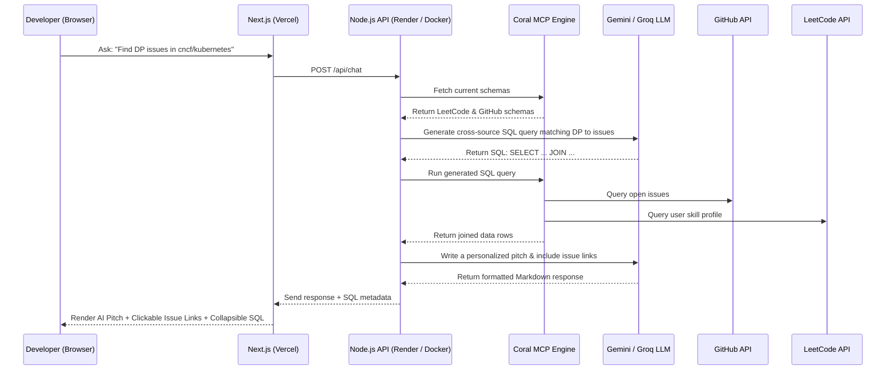

# GSoC & Open-Source Matchmaker Agent

> **An intelligent agent that bridges competitive programming (LeetCode) and open-source contributions (GitHub) for GSoC aspirants.**
> Built for the **[Pirates of the Coral-bean Hackathon](https://www.wemakedevs.org/hackathons/coral)** | Track 2: Personal Agent

---

## 🔗 Live Demo Links
* **Deployed Frontend (Vercel):** [https://open-source-matchmaker.vercel.app](https://open-source-matchmaker.vercel.app)
* **Deployed Backend (Render):** `(https://coral-powered-optimizer.onrender.com)` (or your active Render/tunnel URL)

---

## The Problem
Transitioning from competitive programming (solving DSA problems on platforms like LeetCode) to open-source contribution (GitHub) can feel like hitting a brick wall. Aspiring GSoC contributors often possess strong algorithmic skills but struggle to find codebase issues that match their specific strengths (e.g., finding where graph traversal or dynamic programming is used in real-world organizations).

## The Solution
This project maps a developer's algorithmic skill profile (scraped from LeetCode) directly to active, open issues inside targeted GSoC-participating GitHub repositories. It uses a **federated SQL engine** to perform cross-source JOINs between user skills and GitHub issues, and then uses a reasoning LLM to pitch contribution ideas and output direct links to open issues.

---

## Core Features

* **Algorithmic Skill Discovery:** Connects to your LeetCode profile to fetch your solved problem tags (e.g., Graphs, Trees, Dynamic Programming).
* **Federated Cross-Source Matchmaking:** Executes complex SQL queries that JOIN your LeetCode strengths with open GitHub issues from target repositories.
* **Premium Chat UI:** Includes typing animations, realistic message bubbles, auto-scroll, and markdown rendering so you can click GitHub links directly.
* **Live Schema Explorer:** An interactive tab in the UI that displays the database schemas mapped by Coral MCP.
* **Interactive Prompts:** Quick-start chips that let you easily test matching skills, graph organizations, or DSA issues with a single click.

---

## Technical Transparency: APIs & Repositories Used

To remain fully transparent, the project acts as an orchestration layer using the following open-source resources and APIs:

1. **Coral CLI Engine:** We use [Coral](https://github.com/withcoral/coral) to run federated SQL queries over our data sources. Coral runs as a local Model Context Protocol (MCP) server over STDIO inside a Docker container.
2. **GitHub REST API:** Queried via Coral's native GitHub source mapping to read open issues, pull requests, labels, and issue descriptions.
3. **LeetCode GraphQL API:** Queried using a custom Coral source specification (`sources/leetcode.yaml`) that pulls live user profiles, problem statistics, and tag counts.
4. **Large Language Models (LLMs):**
   * **Gemini 2.5 Flash** (Primary reasoning engine for generating SQL and pitching proposals).
   * **Groq (Llama-3.3-70b)** (Fallback LLM if Gemini reaches rate limits).
   * **OpenAI (GPT-4o-Mini)** (Alternative fallback provider).

---

## Architecture & Data Flow



---

## Local Setup & Development

### Prerequisites
* Windows Subsystem for Linux (WSL) running Ubuntu, or a Linux/macOS machine.
* Node.js 18+ and npm installed.
* [Coral CLI](https://github.com/withcoral/coral) installed.

### 1. Configure Coral CLI
In your Linux/WSL terminal, run:
```bash
# Install Coral
curl -fsSL https://withcoral.com/install.sh | sh
export PATH="$HOME/.local/bin:$PATH"

# Configure GitHub source (Requires a GitHub Classic Personal Access Token)
coral source add --interactive github

# Configure LeetCode custom source spec
coral source add --file ./sources/leetcode.yaml
```

### 2. Set Up the Backend Agent
```bash
cd agent
npm install
cp .env.example .env
# Open .env and add your GEMINI_API_KEY, GROQ_API_KEY, and GITHUB_TOKEN
npm start
# Server runs on http://localhost:3001
```

### 3. Set Up the Frontend UI
```bash
cd ../frontend
npm install
npm run dev
# Dashboard runs on http://localhost:3000
```

---

## Cloud Deployment

### Frontend (Vercel)
The frontend is built with Next.js and deployed to Vercel:
1. Deploy using Vercel CLI:
   ```bash
   cd frontend
   npx vercel --prod
   ```
2. Configure `NEXT_PUBLIC_AGENT_URL` in your Vercel Dashboard to point to your cloud-deployed backend.

### Backend Agent (Render.com + Docker)
Because the backend requires the local `coral` binary and runtime configs, we deploy it using a **Docker Container** on Render's free tier. 

We have included a `Dockerfile` and `entrypoint.sh` in the `agent/` folder:
1. Push your `agent` directory to a private or public GitHub repository.
2. Sign in to **Render.com** and create a new **Web Service** connected to your repository.
3. Render will automatically detect the `Dockerfile` and compile the Node + Coral runtime environment.
4. Set the following environment variables in Render:
   * `GEMINI_API_KEY`: (Your Gemini Key)
   * `GROQ_API_KEY`: (Your Groq Key)
   * `GITHUB_TOKEN`: (Your GitHub Token)
   * `LEETCODE_USERNAME`: (Your LeetCode username)
5. Save and deploy. Render will give you a permanent `https` backend URL to use in your Vercel settings!
